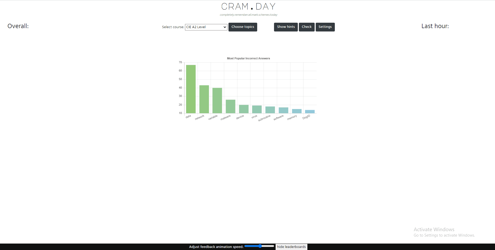

# CRAM.day

## Revision tool used to 'cram' exam paper terminology

### Implemented so far:

1. Syllabus selection / random generation of 'fill the gaps' type questions

2. Dynamically updating leaderboards (all time vs. last hour)

3. 'Show hints'

4. EAL mode - hints pin to the bottom of the screen and can be dragged to fill gaps

5. Random stats on first load

### //TODO

 * prevent 'level up' gap increase making questions impossible to answer (e.g. removing all context)
 * half points for hints?
 * allow synonym lookup from Thesaurus API
 * have other current users vote on acceptable synonyms?